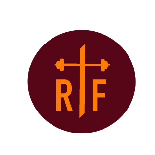

  

<h2 align="center">Redemption Temple Fitness</h2>
  

    Redemption Temple Fitness application for clients and new users looking for a personal trainer to shape their goals for the year can apply for a quote and learn more about the programs offered by Hope himself.
     
    <a href="https://rtf-prototype.onrender.com/">View Demo</a>
    ·
    <a href="https://github.com/pixelRena/rt-fitness/issues">Report Bug</a>
  

  

## Built with
* [![React][React.js]][React-url]
* [![Sass][sass]][sass-url]
* [![AWS ses][aws]][aws-url]
* [![Bootstrap][Bootstrap]][Bootstrap-url]

## Contact
Developer: Serena - [@pixelRena](https://twitter.com/pixelRena) 
Client: Hope - [Contact Page](https://rtf-prototype.onrender.com/contact-me)

Project Link: [https://github.com/pixelRena/rt-fitness](https://github.com/pixelRena/rt-fitness)

[React.js]: https://img.shields.io/badge/React-20232A?style=for-the-badge&logo=react&logoColor=61DAFB
[React-url]: https://reactjs.org/
[sass]: https://img.shields.io/badge/Sass-CC6699?style=for-the-badge&logo=sass&logoColor=white
[sass-url]: https://sass-lang.com/
[aws]: https://img.shields.io/badge/Amazon_AWS-FF9900?style=for-the-badge&logo=amazonaws&logoColor=white
[aws-url]: https://aws.amazon.com/ses/
[Bootstrap]: https://img.shields.io/badge/Bootstrap-563D7C?style=for-the-badge&logo=bootstrap&logoColor=white
[Bootstrap-url]: https://getbootstrap.com
